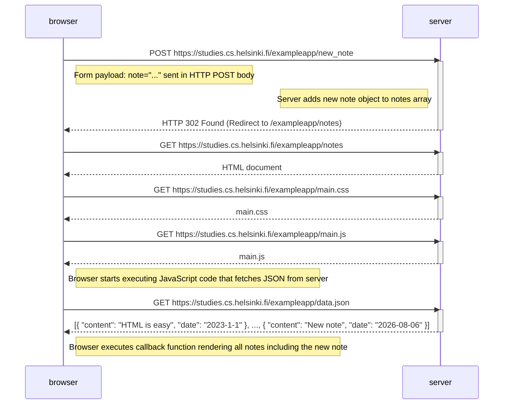

```mermaid
sequenceDiagram
    participant browser
    participant server

    browser->>server: POST https://studies.cs.helsinki.fi/exampleapp/new_note
    activate server
    Note right of browser: Form payload: note="..." sent in HTTP POST body
    Note left of server: Server adds new note object to notes array
    server-->>browser: HTTP 302 Found (Redirect to /exampleapp/notes)
    deactivate server

    browser->>server: GET https://studies.cs.helsinki.fi/exampleapp/notes
    activate server
    server-->>browser: HTML document
    deactivate server

    browser->>server: GET https://studies.cs.helsinki.fi/exampleapp/main.css
    activate server
    server-->>browser: main.css
    deactivate server

    browser->>server: GET https://studies.cs.helsinki.fi/exampleapp/main.js
    activate server
    server-->>browser: main.js
    deactivate server

    Note right of browser: Browser starts executing JavaScript code that fetches JSON from server

    browser->>server: GET https://studies.cs.helsinki.fi/exampleapp/data.json
    activate server
    server-->>browser: [{ "content": "HTML is easy", "date": "2023-1-1" }, ..., { "content": "New note", "date": "2026-08-06" }]
    deactivate server

    Note right of browser: Browser executes callback function rendering all notes including the new note
```
