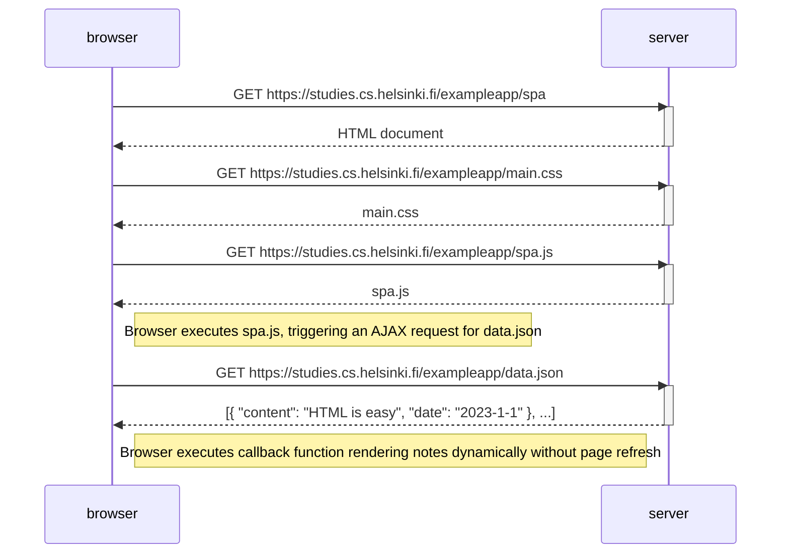

```mermaid
sequenceDiagram
    participant browser
    participant server

    browser->>server: GET https://studies.cs.helsinki.fi/exampleapp/spa
    activate server
    server-->>browser: HTML document
    deactivate server

    browser->>server: GET https://studies.cs.helsinki.fi/exampleapp/main.css
    activate server
    server-->>browser: main.css
    deactivate server

    browser->>server: GET https://studies.cs.helsinki.fi/exampleapp/spa.js
    activate server
    server-->>browser: spa.js
    deactivate server

    Note right of browser: Browser executes spa.js, triggering an AJAX request for data.json

    browser->>server: GET https://studies.cs.helsinki.fi/exampleapp/data.json
    activate server
    server-->>browser: [{ "content": "HTML is easy", "date": "2023-1-1" }, ...]
    deactivate server

    Note right of browser: Browser executes callback function rendering notes dynamically without page refresh
```
