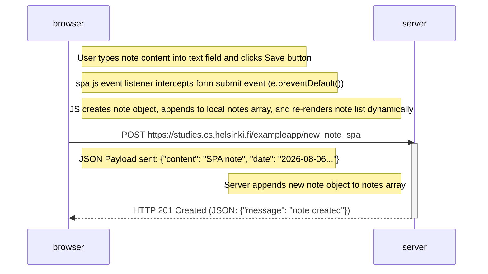

```mermaid
sequenceDiagram
    participant browser
    participant server

    Note right of browser: User types note content into text field and clicks Save button
    Note right of browser: spa.js event listener intercepts form submit event (e.preventDefault())
    Note right of browser: JS creates note object, appends to local notes array, and re-renders note list dynamically

    browser->>server: POST https://studies.cs.helsinki.fi/exampleapp/new_note_spa
    activate server
    Note right of browser: JSON Payload sent: {"content": "SPA note", "date": "2026-08-06..."}
    Note left of server: Server appends new note object to notes array
    server-->>browser: HTTP 201 Created (JSON: {"message": "note created"})
    deactivate server
```
